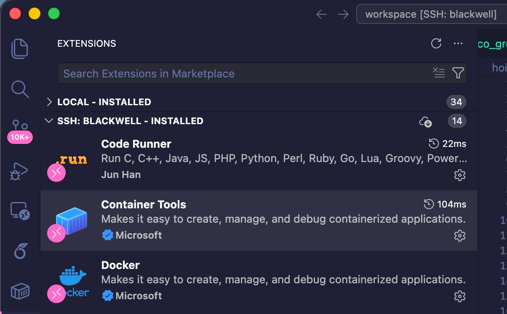
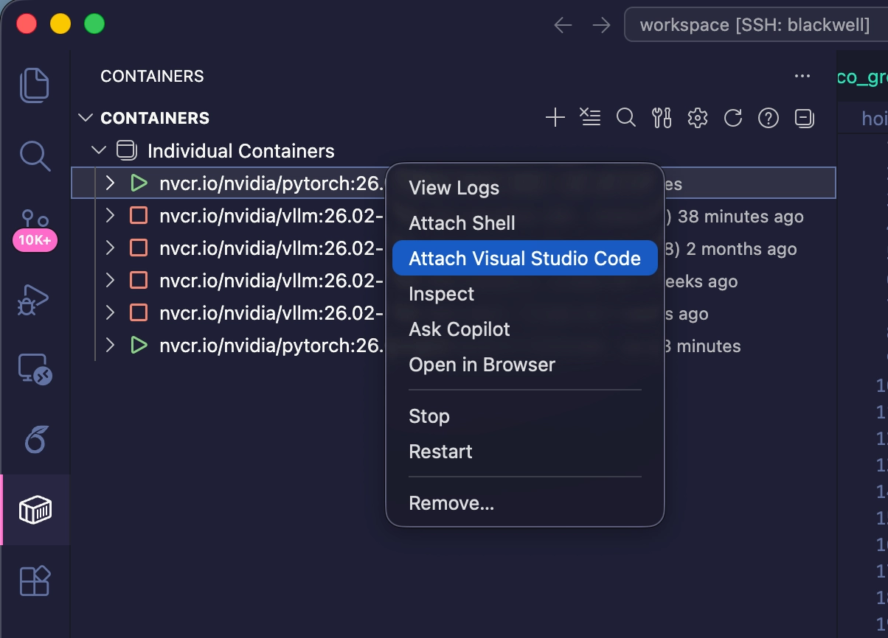

# Lab GPU Server

| Component | Spec |
|---|---|
| Hostname | `rtx-pro-6000-blackwell` |
| GPU | 1 × NVIDIA RTX PRO 6000 Blackwell Workstation (98 GB VRAM) |
| CPU | Intel Core Ultra 9 285K (24 cores) |
| RAM | 64 GB |
| Storage | 4 TB NVMe SSD |

---

# How to use the server

Read this once from top to bottom, then follow the steps in order.

## The one rule

**Only run code and install packages inside your Docker container. Never on the host.**

The host has a fragile NVIDIA driver setup. Installing things there can take the GPU down for everyone. Your container is isolated, so anything you do inside it is safe.

You can tell where you are from the prompt:

| Where you are | Prompt looks like | OK to work here? |
|---|---|---|
| Host | `<username>@rtx-pro-6000-blackwell:~$` | ❌ No, only to enter your container |
| Your container | `root@<random-id>:/workspace/<folder>#` | ✅ Yes |

## What Shaun sends you

Before you start, Shaun (the server admin) sends you:

1. A **Tailscale invitation** email.
2. Your **username** and **password** for the server.
3. The **name of your container** (called `<container>` below).
4. The **folder you can access** inside it (called `/workspace/<folder>` below).

Your container is already created and your folder is already inside it. You do not need to create anything yourself. You only have access to the folder Shaun tells you.

## Step 1: Join the Tailscale VPN

1. Install Tailscale on your laptop: <https://tailscale.com/download>
2. Open the invitation email and accept it.
3. Make sure Tailscale is **switched on** whenever you connect to the server.

No SSH key is needed. Tailscale handles the connection.

## Step 2: Log in to the server

Open a terminal on your laptop and run:

```bash
ssh <username>@rtx-pro-6000-blackwell
```

Enter your password when asked. The first time, Tailscale may also ask you to approve the login in your browser.

A successful login ends with the host prompt:

```text
Welcome to Ubuntu 24.04.4 LTS (GNU/Linux 6.17.0-23-generic x86_64)
...
<username>@rtx-pro-6000-blackwell:~$
```

You are now on the **host**. Do not run code here. Go straight to Step 3.

## Step 3: Enter your container

```bash
docker exec -it <container> /bin/bash
```

The prompt changes to:

```text
<username>@rtx-pro-6000-blackwell:~$ docker exec -it <container> /bin/bash
root@2e915b05cfe5:/workspace/<folder>#
```

When you see `/workspace/<folder>#`, you are inside your container and can start working.

Check the GPU and your files:

```bash
nvidia-smi     # the RTX PRO 6000 should be listed
ls             # your project folder
```

The container already has PyTorch and CUDA. `conda` and `uv` may also be installed. Install anything else you need with `pip`, `conda`, or `uv`, inside the container only.

Files under `/workspace/<folder>` are saved on the server's disk, so they stay after the container or server restarts.

## Step 4 (recommended): Use VS Code

Working in VS Code is much easier than a plain terminal. It has two parts: connect to the server, then attach to your container.

### 4a. Connect VS Code to the server

1. In VS Code, install the **Remote - SSH** extension (`ms-vscode-remote.remote-ssh`).
2. On your laptop, add this to the file `~/.ssh/config` (create it if it does not exist). Replace `<username>` with yours:

   ```text
   Host blackwell
       HostName rtx-pro-6000-blackwell
       User <username>
   ```

3. Open the Command Palette (`Cmd/Ctrl + Shift + P`), run **Remote-SSH: Connect to Host**, choose `blackwell`, and enter your password.

The bottom-left corner of VS Code now shows `SSH: blackwell`.

### 4b. Install the container extension on the server

While connected to `blackwell`, open the Extensions panel and install **Container Tools** (by Microsoft). Make sure it appears under **SSH: BLACKWELL - INSTALLED**, not only under Local.



### 4c. Attach VS Code to your container

1. Click the **Containers** icon in the left sidebar.
2. Under **Individual Containers**, find your container (a green ▶ means it is running). Hover over an entry to see its name.
3. Right-click your container and choose **Attach Visual Studio Code**.



A new VS Code window opens **inside your container**. Open the `/workspace/<folder>` folder, and you can edit and run code directly.

Only attach to **your own** container. Do not stop, restart, or remove any container from this list.

## Quick recap

1. Tailscale on.
2. `ssh <username>@rtx-pro-6000-blackwell`
3. `docker exec -it <container> /bin/bash`
4. Work only inside the container (`/workspace/<folder>#` prompt).
5. Or in VS Code: connect to `blackwell` → Containers → right-click your container → **Attach Visual Studio Code**.

## Need help?

Contact Shaun (the server admin). For installing packages or fixing environment errors inside your container, ChatGPT or Claude can usually help.
